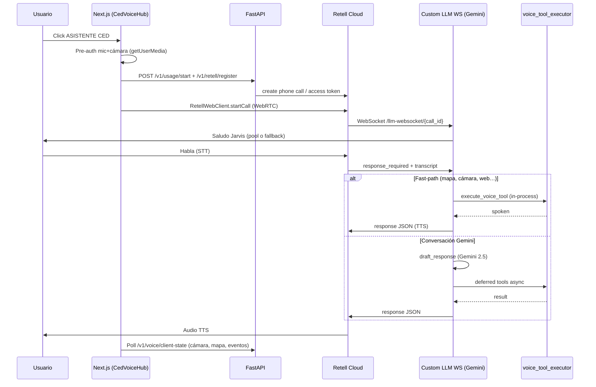
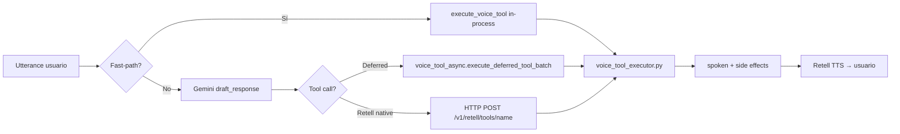
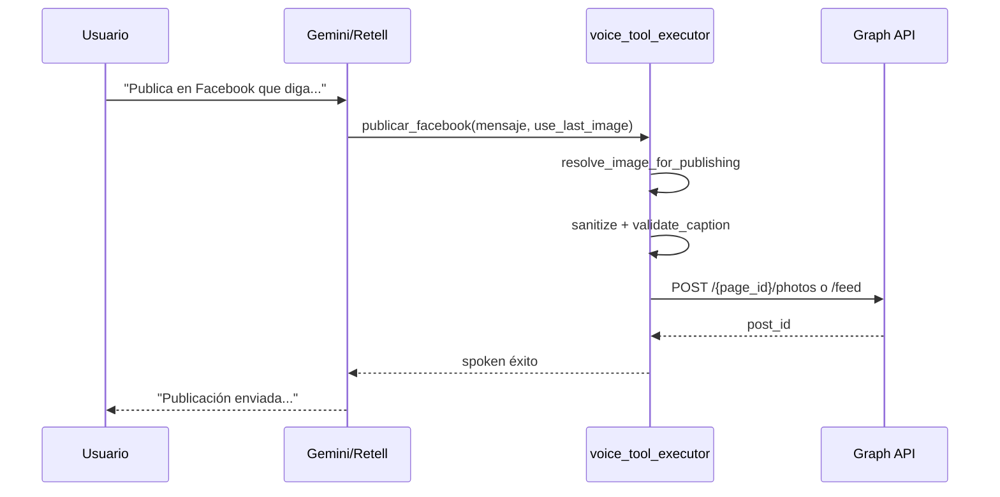
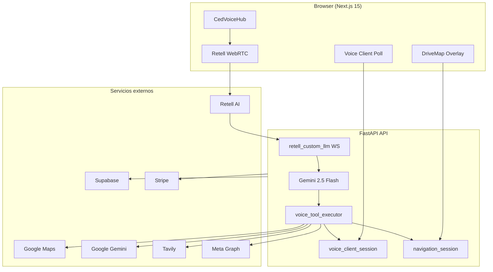

# CED — Arquitectura del sistema (CED-WEB)

Documento de referencia de la arquitectura **actual** del monorepo `CED-WEB` (Castillo Evolución Digital).  
Generado por inspección del código — **solo lectura**, sin modificar runtime.

**Última revisión de código:** commit `90de113` (2026-07-03)  
**Build API:** `2026-07-03-maps-navigation-flow` (`apps/api/app/build_info.py`)  
**Prompt voz:** `v43` (`apps/api/app/domain/openai_voice_prompt.py`)

---

## 1. Stack tecnológico completo

### 1.1 Monorepo

```
CED-WEB/
├── apps/web/          # Frontend Next.js
├── apps/api/          # Backend FastAPI
├── packages/types/    # Tipos TypeScript compartidos
├── packages/ui/       # Tokens UI
└── packages/config/   # TSConfig / ESLint base
```

| Herramienta | Versión |
|-------------|---------|
| Node.js | 22+ (recomendado) |
| pnpm | 9.15.0 |
| Turbo | ^2.5.4 |
| TypeScript | ^5.8.3 |
| Python | 3.11+ |

### 1.2 Frontend (`apps/web`)

| Componente | Tecnología | Versión |
|------------|------------|---------|
| Framework | **Next.js** (App Router, Turbopack en dev) | ^15.3.2 |
| UI | **React** | ^19.1.0 |
| Estilos | **Tailwind CSS** | ^4.1.7 |
| Animación | framer-motion | ^12.9.2 |
| Orbe 3D | three, @react-three/fiber, @react-three/drei | ^0.175 / ^9.1 / ^10.0 |
| Auth / DB cliente | @supabase/ssr, @supabase/supabase-js | ^0.6.1 / ^2.49.8 |
| Voz WebRTC | retell-client-js-sdk | ^2.0.8 |
| Mapas | @googlemaps/js-api-loader | ^2.1.0 |
| IA cliente (legacy Live) | @google/genai | ^1.21.0 |
| Iconos | lucide-react | ^0.511.0 |

**Proxy API:** el frontend no llama FastAPI directamente desde el browser en producción; usa rutas BFF `apps/web/src/app/api/ced/[...path]/route.ts` → `CED_API_URL`.

### 1.3 Backend (`apps/api`)

| Componente | Tecnología | Versión |
|------------|------------|---------|
| Framework | **FastAPI** | >=0.115.0 |
| Servidor | uvicorn[standard] | >=0.32.0 |
| Config | pydantic-settings | >=2.6.0 |
| HTTP cliente | httpx | >=0.27.0 |
| Auth JWT | python-jose | >=3.3.0 |
| Pagos | stripe | >=11.0.0 |
| Cache / rate limit aux | redis, slowapi | >=5.2.0 / >=0.1.9 |
| DB | supabase (Python SDK) | >=2.10.0 |
| Voz Retell | retell-sdk | >=4.0.0 |
| IA | google-genai | >=1.21.0 |
| PDF | fpdf2 | >=2.8.0 |

### 1.4 APIs externas

| Servicio | Uso en CED |
|----------|------------|
| **Retell AI** | Telefonía voz WebRTC, agente, TTS, custom LLM WebSocket |
| **Google Gemini** | Cerebro conversacional voz (Custom LLM), visión, imágenes, PDF compose, búsqueda grounded |
| **Google Maps Platform** | Geocoding, Places (Text Search + Places API New), Directions, Routes API v2 |
| **Tavily** | Snippets web para voz (paralelo con Gemini Search) |
| **OpenAI** | Fallback visión, Realtime legacy, modelo imagen legacy (`gpt-image-1`), chat |
| **Anthropic** | Análisis profundo / chat multimodal fallback (opcional) |
| **Meta Graph API** | Publicación Facebook/Instagram, OAuth, comentarios |
| **Supabase** | Auth, Postgres, storage, perfiles, billing, memoria cognitiva |
| **Stripe** | Suscripciones, recargas, webhooks |
| **Resend** | Email transaccional |
| **YouTube Data API** | Carrusel / contenido (opcional) |
| **ElevenLabs** | Clon de voz Jarvis registrado en Retell (vía `RETELL_VOICE_ID`) |

**Nota:** ChromaDB aparece solo en `MIGRATION_PLAN.md` como idea futura. **No está en el runtime actual.** La memoria cognitiva vive en **Supabase Postgres** (`cognitive_memories`). El conocimiento interno usa **JSON seed + tabla `internal_knowledge_articles`**.

### 1.5 Base de datos y almacenamiento

| Almacén | Contenido |
|---------|-----------|
| **Supabase Postgres** | Usuarios, perfiles, conversaciones, usage/voz, billing, Meta tokens, PDFs metadata, memoria cognitiva, knowledge articles |
| **Supabase Storage / disco API** | Imágenes publicables, media uploads |
| **Redis** (opcional prod) | Cache, paneles SSE multi-instancia |
| **Memoria in-process** | `voice_client_session`, `navigation_session`, PDF L1 cache, dedupe publicaciones |

### 1.6 Infraestructura y dominios

| Entorno | Servicio | Config |
|---------|----------|--------|
| **API** | Railway (Docker) | `railway.api.toml`, `apps/api/Dockerfile`, health `/health` |
| **Web** | Railway (Docker) o Vercel | `railway.web.toml`, `apps/web/Dockerfile`, `vercel.json` |
| **Auth** | Supabase | JWT, OAuth Google (opcional) |

**URLs documentadas en `.env.production.example`:**

| Rol | URL objetivo |
|-----|--------------|
| Frontend | `https://app.castillodigital.com` |
| API | `https://api.castillodigital.com` |
| API Railway (alternativa) | `https://ced-api-production.up.railway.app` |
| Web Railway (alternativa) | `https://cedweb-production.up.railway.app` |

Variables críticas de URL: `WEB_PUBLIC_URL`, `API_PUBLIC_URL`, `CORS_ORIGINS`, `NEXT_PUBLIC_APP_URL`, `NEXT_PUBLIC_API_URL`, `CED_API_URL`.

---

## 2. Flujo de voz

### 2.1 Proveedor por defecto: Retell + Gemini Custom LLM

`VOICE_PROVIDER=retell` (backend) y `NEXT_PUBLIC_VOICE_PROVIDER=retell` (frontend).



### 2.2 Archivos clave del flujo

| Capa | Archivo | Rol |
|------|---------|-----|
| UI | `apps/web/src/components/voice/CedVoiceHub.tsx` | Orbe, botón ASISTENTE CED, controles |
| Sesión | `apps/web/src/hooks/useCedVoiceSession.ts` | Mic, Retell, poll cliente, cámara, mapa events |
| Cliente Retell | `apps/web/src/lib/voice/retell/ced-retell-client.ts` | WebRTC, transcript, barge-in |
| Registro | `apps/api/app/routers/retell.py` | `register`, webhooks, `/v1/retell/tools/*` |
| Cerebro | `apps/api/app/routers/retell_custom_llm.py` | WebSocket Retell ↔ Gemini, fast-paths |
| LLM | `apps/api/app/services/gemini_voice_llm.py` | Prompt, tools, draft_response |
| Prompt | `apps/api/app/domain/openai_voice_prompt.py` | Identidad CED v43 |
| Puente cliente | `apps/api/app/routers/voice_client.py` | Estado cámara, visión, acciones |

### 2.3 Modelo de voz (TTS)

- **Retell** sintetiza la voz del agente; no es Gemini native-audio en el path Retell.
- Voz configurada en Railway: `RETELL_VOICE_ID` (ej. clon ElevenLabs `11labs-George` o clon Jarvis `UKhFmKblQwXqi7vvaALt`).
- Bootstrap: `apps/api/app/services/retell_agent_setup.py` — Custom LLM WebSocket apunta a la API pública.
- Modelo **conversacional** (texto): `GEMINI_VOICE_MODEL` → default `gemini-2.5-flash` (override posible a `gemini-2.5-pro`).

### 2.4 Legacy: OpenAI Realtime / Gemini Live

Si `VOICE_PROVIDER` ≠ `retell`, el frontend puede usar `CedLiveClient` (`apps/web/src/lib/voice/live/`) con `GEMINI_LIVE_MODEL=gemini-2.5-flash-native-audio-preview-12-2025`. **Producción actual usa Retell.**

### 2.5 Interrupciones (barge-in)

| Capa | Comportamiento |
|------|----------------|
| **Retell** | Envía `turntaking: user_turn` / `agent_turn` en updates |
| **Frontend** | `ced-retell-client.ts` silencia audio del agente en barge-in (`setVolume(0)`) y restaura al terminar |
| **Custom LLM** | `generation_seq` + `turn_latest_rid` cancelan turnos superseded; `cancel_greeting_stream` si el usuario habla durante saludo |
| **Debounce** | ~100–220 ms según longitud del utterance antes de procesar |

### 2.6 Saludo

1. Retell envía `call_details` → `send_greeting()` en WebSocket.
2. Texto desde `voice_greetings.pick_jarvis_greeting()` o Gemini con overlay de saludo.
3. Fallback garantizado: `"CED en línea, señor. Estoy listo para asistirle."` si el texto es incompleto.
4. Un solo chunk con `content_complete: true`.

---

## 3. Flujo de tools / comandos

### 3.1 Lista completa de tools (Retell custom functions)

Definidas en `apps/api/app/services/openai_voice_tools.py`, expuestas vía `retell_tools.build_retell_general_tools()` → POST `{API}/v1/retell/tools/{name}`.

| Tool | Propósito |
|------|-----------|
| `search_web` | Clima, noticias, datos en tiempo real (Tavily + Gemini) |
| `generate_image` | Imagen IA desde prompt (Gemini Image) |
| `generate_image_with_reference` | Variación/edición con imagen de referencia |
| `save_memory` | Memoria cognitiva clave/valor |
| `recall_memory` | Recuperar memoria por clave |
| `recall_previous_conversations` | Historial conversaciones |
| `save_to_long_term_memory` | Memoria largo plazo |
| `request_camera_activation` | Activar cámara cliente |
| `request_camera_deactivation` | Apagar cámara |
| `analyze_uploaded_image` | Visión sobre imagen del chat |
| `analyze_camera_frame` | Visión sobre frame de cámara |
| `buscar_lo_visible` | Identificar objeto + búsqueda web |
| `generar_pdf` | Generar PDF |
| `leer_comentarios_redes` | Comentarios FB/IG |
| `activar_prospeccion` / `desactivar_prospeccion` / `reporte_prospeccion` | Modo prospección |
| `publicar_facebook` / `publicar_instagram` | Publicación Meta |
| `search_nearby_places` | Búsqueda lugares cerca (mapa) |
| `start_navigation` | Iniciar ruta |
| `stop_navigation` | Detener navegación |
| `navigation_status` | ETA / estado ruta |
| `activar_modo_conducir` | Abrir overlay mapa |
| `buscar_direccion` / `iniciar_navegacion` / `cancelar_navegacion` / `estado_navegacion` | Aliases legacy navegación |

### 3.2 Detección de intención

Capas en paralelo (voz Retell):

1. **Fast-path regex/intent** en `retell_custom_llm.py` — mapa, cámara, web, meta publish, confirmación nav "sí".
2. **`cognitive_intents.py`** — patrones para clima, noticias, publicación, cámara, etc.
3. **`retell_custom_llm.py` helpers** — `resolve_camera_voice_request`, `resolve_web_search_request`, `resolve_meta_publish_request`, `resolve_navigation_*`.
4. **Gemini function calling** — `gemini_voice_llm.draft_response()` con tools declaradas en `gemini_voice_tools.py`.
5. **Frontend intents** (Gemini Live legacy) — `apps/web/src/lib/voice/*Intent.ts`.

Router híbrido chat: `cognitive_router.route_message()` — internal KB vs web vs memoria.

### 3.3 Ejecución



- **Executor central:** `apps/api/app/services/voice_tool_executor.py`
- **Async / no bloqueante:** `apps/api/app/services/voice_tool_async.py`
- **Timeouts:** `retell_tools.TIMEOUT_MS` por tool

### 3.4 Entrega al usuario

| Canal | Mecanismo |
|-------|-----------|
| **Voz** | JSON WebSocket Retell `{ content, content_complete }` → TTS |
| **HUD transcript** | Callback `onTranscript` → `HudFeedContext` |
| **Eventos UI** | `push_tool_event` → poll frontend (`generated_image`, `pdf_created`, `camera_activate`, `navigation_instruction`, `map_search_results`) |
| **Acciones cliente** | `push_client_action` → poll (`camera_activate`, `camera_capture`, …) |

---

## 4. Flujo de mapa

### 4.1 Búsqueda de lugares

1. Usuario: *"busca Walmart cerca"* (voz o mapa).
2. Fast-path o tool `search_nearby_places` → `voice_tool_executor` → `navigation_maps.search_nearby_places()`.
3. Usa GPS del cliente (`navigation_session.update_location`) + **Google Places** (Text Search legacy o Places API New).
4. Resultados guardados en `navigation_session.set_place_options()` y `voice_client_session.set_map_search_results()`.
5. Frontend recibe evento `ced-navigation-event` / `map_search_results` → `DriveMapContext` → lista en overlay.

### 4.2 Inicio de navegación

1. Usuario elige: *"el primero"*, *"sí"* (con `navigation_pending`), o índice explícito.
2. `resolve_navigation_confirm()` o tool `start_navigation`.
3. `navigation_maps.compute_route()` — **Routes API v2** (fallback Directions API).
4. `navigation_session` → `navigating=true`, polyline, steps.
5. Panel mapa: `NavigationPanel`, guía paso a paso vía `useNavigationGuide`.

### 4.3 Comunicación voz ↔ mapa

| Dirección | Mecanismo |
|-----------|-----------|
| Voz → Mapa | `push_tool_event({ type: map_search_results })` o acciones nav en `navigation_session.client_action` |
| GPS voz → Mapa | Instrucciones GPS **no** van al diálogo HUD; canal `navigation_instruction` → evento `ced-navigation-voice` |
| Mapa → API | `POST /v1/navigation/location`, `/route`, etc. |

### 4.4 Google Maps APIs usadas

| API | Endpoint / uso |
|-----|----------------|
| Geocoding | `maps.googleapis.com/maps/api/geocode/json` |
| Places Text Search | `.../place/textsearch/json` |
| Places API (New) | `places.googleapis.com/v1/places:searchText` |
| Directions | `.../directions/json` |
| Routes v2 | `routes.googleapis.com/directions/v2:computeRoutes` |

Clave: `GOOGLE_MAPS_API_KEY` o fallback `GOOGLE_API_KEY` (`navigation_maps._maps_key()`).

---

## 5. Flujo de publicación redes sociales

### 5.1 Requisitos previos

- OAuth Meta conectado en dashboard (`/v1/meta/oauth/*`).
- Tokens en Supabase (`meta_connections`).
- Imagen publicable en sesión voz o chat (`voice_client_session.last_publishable_image`).

### 5.2 Facebook



- Implementación: `meta_social.publish_facebook()`.
- Imagen: bytes upload o URL pública HTTPS (`publish_media.resolve_image_input`).
- Dedupe: `meta_publish_dedupe` evita doble post en 30 s.

### 5.3 Instagram

- Tool `publicar_instagram` — **requiere imagen** (URL HTTPS pública).
- Flujo Graph: crear container → publicar media.
- Caption: `sanitize_publish_caption` + `validate_caption`.
- Estado `awaiting_instagram_caption` si falta caption en sesión.

### 5.4 Manejo de imagen

| Origen | Registro |
|--------|----------|
| Chat upload | `POST /v1/voice/chat-image` → disco + `set_last_publishable_image` |
| Imagen generada voz | Tool result → `push_tool_event(generated_image)` → HUD |
| Cámara | Frame JPEG → visión / publicación |
| Referencia | `generate_image_with_reference` |

### 5.5 Validación de caption

`apps/api/app/services/publish_text.py`:

- `sanitize_publish_caption()` — quita *"publica que diga"*, comillas, prefijos instrucción.
- `validate_caption()` — rechaza: vacío, instrucciones a CED, labels UI, historial de chat, repetición excesiva.
- Meta social lanza `MetaSocialError` → mensaje hablado pidiendo confirmación.

---

## 6. Flujo de visión / cámara

### 6.1 Pre-autorización (arquitectura actual)

Chrome exige **gesto de usuario** para `getUserMedia`. Por eso:

1. Al click **ASISTENTE CED**, `primeSessionMediaFromGesture()` pide mic + cámara.
2. Stream de video se guarda con `track.enabled = false`.
3. Backend recibe `POST /v1/voice/camera-status` con `permissionGranted`.
4. Al decir *"activa la cámara"*, solo se habilita el track — **sin nuevo popup**.

### 6.2 Activación por voz

1. Fast-path `is_camera_activation_intent()` en `retell_custom_llm.py`.
2. `push_client_action(camera_activate)` + `push_tool_event(camera_activate)`.
3. Frontend poll 450 ms → `activateCameraFromVoice()` → enable tracks → `#ced-camera-feed`.
4. `POST /v1/voice/camera-status` `{ active: true, streamPresent: true }`.

### 6.3 Captura de frame

1. Tool `analyze_camera_frame` / `buscar_lo_visible` → `_run_camera_capture()`.
2. Si cámara off → auto `camera_activate` + wait ACK (8 s).
3. `push_client_action(camera_capture, { request_id, question, mode })`.
4. Frontend captura JPEG desde `<video>` → `POST /v1/vision/analyze` o web search.
5. Resultado → `POST /v1/voice/vision-result` → backend `pop_vision_result`.

### 6.4 Análisis Gemini

- Servicio: `apps/api/app/services/vision_search.py`
- Modelo: **`gemini-2.5-flash`** (visión).
- Prompt estructurado pide respuesta corta; post-proceso `format_vision_response()` quita `1)` y cierra con tono CED.

### 6.5 Resultado a voz

- Executor devuelve `{ spoken: "..." }`.
- Fast-path visión: un solo `send_voice_response` con filler + resultado formateado.
- Retell TTS reproduce al usuario; HUD puede mostrar transcript vía Retell updates.

---

## 7. Flujo de búsqueda web

### 7.1 Tavily + Gemini en paralelo

`apps/api/app/services/gemini_grounded.py`:

| Parámetro | Valor |
|-----------|-------|
| Modelo brief | `gemini-2.5-flash` + Google Search tool |
| Tavily timeout | 12 s |
| Gemini timeout | 12 s |
| Paralelo total | 20 s (`SEARCH_WEB_PARALLEL_TIMEOUT_SEC`) |
| Tool timeout voz | 17 s (`SEARCH_WEB_TIMEOUT_SEC`) |

Flujo: `_run_tavily` ∥ `_run_gemini_search` → mejor snippet → `fit_voice_spoken()` → entrega voz.

### 7.2 Fast-path voz

`resolve_web_search_request()` en `retell_custom_llm.py`:

1. Filler único (`web_search_hold_phrase`).
2. `handle_web_search_voice()` → `execute_voice_tool("search_web")`.
3. Formato final: `format_web_delivery()` en `retell_custom_llm.py`.

### 7.3 Fallbacks

- Timeout → frase de error / `WEB_SEARCH_VOICE_FALLBACK`.
- Gemini sin datos → Tavily o respuesta con disclaimer (prompt REGLA 3).
- Duplicados recientes → skip con mensaje alternativo.

---

## 8. Flujo de generación de imágenes

| Paso | Detalle |
|------|---------|
| Modelo | **`gemini-2.5-flash-image`** (primary), fallback `gemini-2.0-flash-preview-image-generation` |
| Servicio | `apps/api/app/services/gemini_images.py` |
| Límites | Plan-based daily counts en Supabase |
| Tool voz | `generate_image` / `generate_image_with_reference` |
| Entrega | URL almacenada → `push_tool_event({ type: generated_image })` → HUD + chat seed |
| Coste tracking | `GEMINI_STD_COST_USD` / `GEMINI_HD_COST_USD` |

---

## 9. Flujo de generación de PDF

| Paso | Detalle |
|------|---------|
| Tool | `generar_pdf` (timeout 90 s) |
| Contenido | `normalize_pdf_fields` + `resolve_pdf_content`; si vacío, compose con **Gemini 2.5 Flash** |
| Generación | `fpdf2` en `pdf_report.py` → bytes |
| Persistencia | Supabase + cache L1 48 h |
| Entrega voz | spoken + `push_tool_event({ type: pdf_created, file_id, title })` |
| Frontend | Auto-download vía `downloadPdfBlob()` en poll |

---

## 10. Estados de sesión

CED usa **dos stores in-memory** por `user_id` (TTL 3600 s), no un único objeto `session_state`:

### 10.1 `voice_client_session` (`apps/api/app/services/voice_client_session.py`)

| Campo | Tipo | Función |
|-------|------|---------|
| `client_action` | `{ id, action, payload }` | Cola acción pendiente para el browser (cámara, captura) |
| `camera_active` | bool | Cámara lógicamente activa |
| `camera_stream_present` | bool | Cliente confirmó stream live (heartbeat) |
| `camera_permission_granted` | bool | Pre-auth al inicio sesión |
| `camera_updated_at` | float | Timestamp último heartbeat cámara |
| `vision_results` | dict | `{ request_id: { summary, at } }` pendientes de pop |
| `last_publishable_image` | dict | Imagen para publicar/analizar |
| `publishable_images` | list | Historial reciente (max 8) |
| `awaiting_instagram_caption` | bool | Esperando caption IG |
| `active_voice_call_id` | str | Retell call_id activo |
| `active_mode` | str \| null | `camera` \| `map` \| `prospect` — inyectado en prompt Gemini |
| `map_search_results` | list | Copia resultados búsqueda para contexto LLM |
| `tool_events` | list | Eventos UI (max 24): imagen, PDF, nav, cámara |
| `updated_at` | float | TTL refresh |

**Limpieza:**

- TTL 1 h sin actividad → sesión fresca.
- `end_voice_publish_session()` — fin voz, limpia imagen y call_id.
- `set_camera_active(false)` — apaga modo cámara en prompt.
- Nueva llamada Retell con distinto `call_id` → limpia imagen publicable.

### 10.2 `navigation_session` (`apps/api/app/services/navigation_session.py`)

| Campo | Función |
|-------|---------|
| `location` | Último GPS `{ lat, lng, heading, speed, accuracy }` |
| `route` | Ruta activa (polyline, steps, ETA) |
| `place_options` | Lista lugares de búsqueda |
| `place_query` | Query original |
| `navigation_pending` | Esperando confirmación "sí" / índice |
| `pending_navigation_index` | Índice seleccionado |
| `pending_destination` | Place dict pendiente |
| `client_action` | Acciones mapa para frontend |
| `navigating` | Ruta en curso |
| `current_step_index` | Paso actual turn-by-turn |
| `announced_steps` | Pasos ya anunciados por voz |
| `updated_at` | TTL |

**Limpieza:** `clear_navigation()`, `clear_place_options()`, TTL 1 h.

---

## 11. Archivos principales

### 11.1 Frontend

| Archivo | Rol |
|---------|-----|
| `apps/web/src/hooks/useCedVoiceSession.ts` | Orquestación voz, cámara, poll, Retell |
| `apps/web/src/components/voice/CedVoiceHub.tsx` | UI central dashboard voz |
| `apps/web/src/lib/voice/retell/ced-retell-client.ts` | WebRTC Retell |
| `apps/web/src/contexts/DriveMapContext.tsx` | Estado mapa overlay |
| `apps/web/src/contexts/HudFeedContext.tsx` | Feed conversación HUD |
| `apps/web/src/components/navigation/*` | Mapa, panel, búsqueda |
| `apps/web/src/app/api/ced/[...path]/route.ts` | Proxy BFF → API |
| `apps/web/src/lib/env.ts` | URLs públicas |

### 11.2 Backend — routers

| Router | Prefijo | Rol |
|--------|---------|-----|
| `retell_custom_llm.py` | `/llm-websocket` | Cerebro voz WebSocket |
| `retell.py` | `/v1/retell` | Registro llamadas, tools HTTP |
| `voice_client.py` | `/v1/voice` | Puente cámara/visión |
| `navigation.py` | `/v1/navigation` | GPS, rutas, búsqueda |
| `chat.py` | `/v1/chat` | Chat texto |
| `cognitive.py` | `/v1/cognitive` | Router cognitivo |
| `meta.py` | `/v1/meta` | OAuth Meta |
| `billing.py` | `/v1/billing` | Stripe |
| `usage.py` | `/v1/usage` | Minutos voz |
| `vision.py` | `/v1/vision` | Análisis imagen REST |
| `pdf.py` | `/v1/pdf` | Descarga PDFs |

### 11.3 Backend — servicios críticos

| Archivo | Rol |
|---------|-----|
| `voice_tool_executor.py` | Ejecutor universal tools |
| `gemini_voice_llm.py` | Gemini conversación + tools |
| `gemini_grounded.py` | Búsqueda web paralela |
| `navigation_maps.py` | Google Maps |
| `navigation_voice.py` | Instrucciones GPS voz |
| `meta_social.py` | FB/IG publish |
| `gemini_images.py` | Generación imágenes |
| `pdf_report.py` | PDF |
| `vision_search.py` | Visión + Tavily visual |
| `cognitive_intents.py` | Clasificación intents |
| `cognitive_router.py` | Router híbrido chat |
| `config.py` | Settings / env |
| `build_info.py` | BUILD_VERSION |

### 11.4 Configuración clave

| Qué | Dónde |
|-----|-------|
| Variables entorno API | `apps/api/.env`, `apps/api/app/config.py` |
| Variables entorno Web | `apps/web/.env.local` |
| Plantilla producción | `.env.production.example` |
| Prompt identidad CED | `apps/api/app/domain/ced_identity.py`, `openai_voice_prompt.py` |
| Capacidades voz | `apps/api/app/domain/ced_voice_capabilities.py` |
| Tools schema | `apps/api/app/services/openai_voice_tools.py` |
| Deploy Railway | `railway.api.toml`, `railway.web.toml` |
| Saludos Jarvis | `apps/api/app/services/voice_greetings.py` |

---

## 11. Variables de entorno

### 11.1 Críticas (sin ellas falla core)

| Variable | Servicio | Propósito |
|----------|----------|-----------|
| `SUPABASE_URL` | API | Base de datos |
| `SUPABASE_SERVICE_ROLE_KEY` | API | Acceso server-side |
| `SUPABASE_JWT_SECRET` | API | Validar JWT |
| `NEXT_PUBLIC_SUPABASE_URL` | Web | Auth cliente |
| `NEXT_PUBLIC_SUPABASE_ANON_KEY` | Web | Auth cliente |
| `RETELL_API_KEY` | API | Voz producción |
| `GOOGLE_API_KEY` | API | Gemini cerebro + visión + imágenes |
| `API_PUBLIC_URL` | API | Webhooks Retell/Meta, URLs imagen |
| `WEB_PUBLIC_URL` | API | CORS, redirects |
| `CED_API_URL` | Web | Proxy server-side |

### 11.2 Voz Retell

| Variable | Propósito |
|----------|-----------|
| `VOICE_PROVIDER` | `retell` (default) u OpenAI legacy |
| `RETELL_AGENT_ID` | Agente Retell |
| `RETELL_LLM_ID` | Custom LLM vinculado |
| `RETELL_VOICE_ID` | Voz TTS (ElevenLabs/Cartesia vía Retell) |
| `RETELL_WEBHOOK_SECRET` | Verificación webhooks |
| `GEMINI_VOICE_MODEL` | Modelo Gemini texto (`gemini-2.5-flash` default) |
| `ELEVENLABS_API_KEY` | Bootstrap clon Jarvis |
| `NEXT_PUBLIC_VOICE_PROVIDER` | Selector frontend |

### 11.3 Mapas

| Variable | Propósito |
|----------|-----------|
| `GOOGLE_MAPS_API_KEY` | Places, Routes, Geocoding |
| `NEXT_PUBLIC_GOOGLE_MAPS_KEY` | Maps JavaScript API frontend |

### 11.4 IA auxiliar

| Variable | Propósito |
|----------|-----------|
| `TAVILY_API_KEY` | Búsqueda web snippets |
| `OPENAI_API_KEY` | Realtime legacy, fallback visión, chat |
| `ANTHROPIC_API_KEY` | Análisis profundo (opcional) |
| `GEMINI_LIVE_MODEL` | Gemini Live legacy |
| `GEMINI_IMAGE_MODEL` | Override modelo imagen |

### 11.5 Meta / Stripe / infra

| Variable | Propósito |
|----------|-----------|
| `META_APP_ID` / `META_APP_SECRET` | OAuth Facebook/Instagram |
| `META_OAUTH_SCOPES` | Permisos Graph |
| `STRIPE_SECRET_KEY` / `STRIPE_WEBHOOK_SECRET` | Pagos |
| `STRIPE_PRICE_*` | Planes y recargas |
| `REDIS_URL` | Cache SSE (prod) |
| `RESEND_API_KEY` | Email |
| `CORS_ORIGINS` | Orígenes permitidos API |
| `APP_ENV` | `production` activa hardening |
| `SUPER_ADMIN_EMAILS` | Acceso admin |

Lista completa de referencia: `apps/api/.env.example`, `.env.production.example`, `apps/web/.env.example`.

---

## 12. Versiones actuales

| Concepto | Valor | Fuente |
|----------|-------|--------|
| **prompt_version** | `v43` | `CED_PROMPT_VERSION` en `openai_voice_prompt.py` |
| **build_version** | `2026-07-03-maps-navigation-flow` | `apps/api/app/build_info.py` |
| **API package** | `0.1.0` | `apps/api/app/main.py` FastAPI |
| **Web package** | `0.1.0` | `apps/web/package.json` |
| **Último commit** | `90de113` — 2026-07-03 21:54 UTC-4 | `fix(presentation): eliminar duplicados...` |
| **Health check** | `GET /health` → `{ build, timestamp }` | Visible tras deploy Railway |

---

## Diagrama de alto nivel



---

## Referencias adicionales

- `docs/ENV_SETUP.md` — configuración local
- `docs/DEPLOY.md` — deploy Railway/Vercel
- `docs/VOICE_WORKING_CONFIG.md` — Gemini Live legacy
- `docs/COGNITIVE_BRAIN.md` — router cognitivo
- `MIGRATION_PLAN.md` — roadmap desde desktop PyQt6

---

*Documento generado automáticamente desde el estado del repositorio CED-WEB. No modifica código ni configuración de runtime.*
