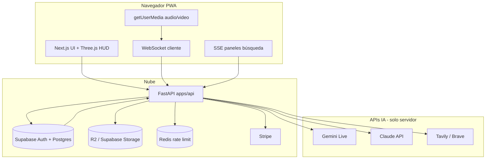

# CED — Plan de migración a Web App (SaaS)

**Autor del plan:** Cursor (borrador para revisión con Keini Castillo)  
**Fecha:** 2026-06-03  
**Carpeta del nuevo proyecto:** `C:\Users\keini\OneDrive\Escritorio\CED-WEB`  
**Código legacy (no tocar):** `C:\Users\keini\OneDrive\Escritorio\CED\` (desktop + `ced-backend` + `installer`)

---

## A) Resumen ejecutivo

La decisión de migrar CED de escritorio Windows (PyQt6 + PyInstaller + instalador LAN) a una **web app SaaS en la nube** es **estratégicamente correcta** dado el estado actual: los problemas de instalación, distribución sin firma de código, dependencia de IP local y techo de ~5–10 betas no se resuelven con más parches al instalador. El producto que describes (voz en tiempo real, visión, paneles HUD, suscripciones, panel admin) encaja naturalmente en un modelo **un solo origen, acceso multiplataforma, facturación recurrente**.

El alcance que planteas es **ambicioso y viable**, pero no es un “port” de 2 semanas: es un **producto nuevo** que **reutiliza** lógica Python (Gemini Live, Claude, prompts, herramientas, Meta OAuth, PDFs) y **reescribe por completo** la capa de presentación y el runtime de audio/video del cliente. Un MVP creíble con voz + auth + UI holográfica + memoria básica + Stripe está en el orden de **3–4 meses** de trabajo enfocado (o **12–18 semanas** en calendario con fricción real). Las fases Pro (imágenes, Whisper, ElevenLabs) y el panel admin completo conviene tratarlos como **producto V1.1 / V2**, no como bloqueantes del primer ingreso.

**Recomendación:** congelar el instalador desktop como canal beta legacy; invertir en `CED-WEB` con entregas verticales demostrables cada 2–3 semanas (auth → voz → HUD panels → pagos → admin mínimo).

---

## B) Estructura del proyecto propuesta

### Nombre de carpeta: `CED-WEB`

Justificación: paralelo claro a `CED/`, fácil de distinguir en OneDrive, sin mezclar con `installer/` ni romper rutas de betas actuales.

### Monorepo con **pnpm workspaces** (sin Turborepo en Fase 0)

| Ruta | Contenido |
|------|-----------|
| `apps/web` | Next.js (App Router), TypeScript, Tailwind 4, shadcn/ui, Three.js/R3F, Framer Motion, PWA |
| `apps/api` | FastAPI: extensión/evolución de `ced-backend` + WebSockets Gemini + SSE búsqueda + jobs |
| `packages/types` | Tipos TS compartidos (User, Plan, PanelEvent, SubscriptionStatus, etc.) |
| `packages/ui` | Tokens de diseño CED (cyan `#00e5ff`, Orbitron/Inter), primitivos shadcn envueltos |
| `packages/config` | ESLint, TSConfig base, constantes de planes |
| `docs/` | ADRs, diagramas, runbooks deploy |

**Por qué pnpm workspaces y no Turborepo al inicio:** menos superficie de configuración para una sola persona/equipo pequeño; Turborepo se añade cuando CI y builds paralelos lo justifiquen (Fase 6+).

**Por qué separar `apps/web` y `apps/api`:**

- Las API keys y Gemini Live **nunca** van al bundle del navegador.
- FastAPI ya existe parcialmente en `ced-backend`; migrar routers y ampliar es más barato que reescribir auth en Node.
- WebSockets y SSE de larga duración encajan mejor en un proceso Python persistente (Railway/Render) que en funciones serverless puras.

**Por qué `packages/types`:** contrato estable entre frontend y backend para paneles HUD, eventos de streaming y planes Stripe.

**Por qué `packages/ui`:** una sola fuente de verdad para el “Tony Stark look” (glow, bordes HUD, tipografías) sin duplicar CSS en admin y cliente.

### Dominios objetivo (propuesta)

| Subdominio | Rol |
|------------|-----|
| `ced.castillodigital.com` | App única (cliente + botón admin para Keini) |
| `api.castillodigital.com` | FastAPI + WebSocket |
| `admin.castillodigital.com` | Opcional: redirect a `/admin` en la misma app Next |

**Decisión recomendada:** una sola app Next en `ced.*` con middleware de rol; evita duplicar auth y cookies.

### Diagrama lógico (alto nivel)



---

## C) Análisis del código actual (`CED/`)

### C1. Reutilizable (adaptar, no copiar pegado)

| Módulo / área | Ruta actual | Uso en web |
|---------------|-------------|------------|
| Prompts / personalidad | `ced/config/prompts.py` | System instructions servidor; versionar por plan |
| Settings / env | `ced/config/settings.py`, `constants.py` | Modelo Pydantic en `apps/api` |
| Gemini Live | `ced/gemini/live_session.py`, `live_config.py`, `message_handler.py`, `client_factory.py`, `reconnect.py` | **Backend WebSocket proxy**; cliente envía PCM/opus o WebRTC bridge |
| Cerebro avanzado | `ced/integrations/advanced_brain.py`, `advanced_brain_tool.py` | Endpoint streaming Claude + sanitización |
| Memoria JSON | `ced/integrations/memory.py`, `memory_tool.py` | Migrar esquema a Postgres; lógica de merge/heurísticas |
| Memoria cognitiva | `ced/integrations/cognitive_memory.py` | Chroma en servidor o pgvector en Supabase |
| PDF | `ced/integrations/pdf_report.py`, `pdf_report_tool.py` | Generar en API → Storage → URL descarga |
| Meta OAuth | `token_manager.py`, `facebook.py`, `instagram.py`, `prospector.py` | Redirect URI web; tokens en Postgres cifrados |
| Herramientas Gemini | `*_tool.py` varios | Reimplementar como “tool handlers” en API |
| Comercial / JWT | `ced/commercial/*` + **`ced-backend/` completo** | Base de auth/suscripción; ampliar roles `super_admin` |
| Estado sesión | `ced/core/state.py`, `events.py` | Patrones para máquina de estados voz en servidor |
| Texto guía capacidades | `ced/ui/ced_guide.py` | Copy para `/help` (sin Qt) |

### C2. Reescribir desde cero

| Área | Motivo |
|------|--------|
| Toda `ced/ui/**` (PyQt6, QSS, widgets HUD) | → React + Tailwind + R3F + Framer Motion |
| `ced/audio/**` | → Web Audio API + codec en navegador; servidor solo puente Gemini |
| `ced/core/session_controller.py` (acoplamiento mic/speaker Qt) | → Orquestador en API + cliente ligero |
| `ced/integrations/oauth_server.py` (localhost:8765) | → Callback HTTPS en Next/API |
| `ced/integrations/vision.py` (USB OpenCV) | → `getUserMedia` + frames al socket |
| `ced/integrations/system_launcher.py`, `browser_launcher.py` | No aplican en web |
| Historial UI | `conversation_history.py` → componentes React |

### C3. Descartar (legacy desktop)

| Área | Rutas |
|------|-------|
| Instalador | `installer/**` |
| PyInstaller | `packaging/**`, `*.spec`, `dist/**`, `scripts/build_*.py` |
| Flask beta LAN | `installer/server/` |
| Gate PyQt | `ced/ui/commercial/commercial_gate.py` (mantener lógica en `gates.py` vía API) |
| Paths frozen exe | Ramas PyInstaller en `ced/paths.py` |

### C4. No viable en web (documentar, no prometer)

| Función desktop | Alternativa web |
|-----------------|-----------------|
| Abrir programas locales (`system_launcher`) | No disponible; sugerir enlaces/deeplinks |
| Guardar PDF directo en Escritorio (`SHGetFolderPathW`) | Descarga blob / email con adjunto |
| Screenshots de escritorio | No |
| Acceso arbitrario al filesystem del usuario | Solo archivos que el usuario suba |
| Instalador / actualizaciones `.exe` | Deploy continuo Vercel/Railway |
| Prospección 24/7 sin servidor siempre encendido | Requiere **workers** en nube (cron/queue), no laptop Keini |

### C5. Búsqueda web actual (dispersa)

No hay un `search.py` único. Hoy:

- `browser_launcher.py` — abre Google en navegador externo.
- `advanced_brain.py` — Claude `web_search` tool.
- `vision_tool.py` — `vision_search_web`.
- Reglas en `prompts.py`.

**En web:** unificar en servicio `SearchOrchestrator` (Tavily/Brave) + SSE a paneles HUD (sección Paneles al final).

### C6. `commercial_gate` (ubicación real)

- UI PyQt: `ced/ui/commercial/commercial_gate.py` (descartar UI).
- Lógica: `ced/commercial/gates.py`, `api_client.py`, `auth_store.py`.
- Backend: `ced-backend/app/routers/auth.py`, `subscription.py`, `webhooks.py`.

---

## D) Roadmap por fases (estimación honesta)

Horas = trabajo efectivo de desarrollo + pruebas manuales; semanas = calendario con 15–25 h/semana (una persona).

| Fase | Entregable | Horas | Semanas (1 dev) |
|------|------------|-------|-----------------|
| **0** | Monorepo, CI básico, deploy staging vacío, Supabase proyecto, env secrets | 18–25 h | 1 |
| **1** | Auth (Supabase + roles cliente/admin), shell UI holográfica responsive, middleware `/admin` | 35–45 h | 1.5–2 |
| **2** | Gemini Live: WS API, permisos mic, estados escuchando/pensando/hablando, barge-in, límites sesión | 55–70 h | 2–2.5 |
| **2b** | **Paneles HUD tiempo real** (SSE + clasificación resultados) — ver sección dedicada | 40–55 h | 1.5–2 |
| **3** | Claude cerebro avanzado streaming + indicador “modo profundo” | 22–30 h | 1 |
| **4** | Memoria + carpetas en Postgres/Storage; historial; export | 35–45 h | 1.5–2 |
| **5** | PDFs server-side + descarga + plantillas | 18–25 h | 1 |
| **6** | Stripe planes, trial 7 días, webhooks, límites por plan, portal cliente | 30–40 h | 1.5–2 |
| **7** | Panel admin MVP (usuarios, MRR básico, cambiar plan, anuncios banner) | 45–60 h | 2 |
| **7b** | Admin completo (notificaciones masivas, feature flags, soporte) | 40–55 h | 1.5–2 |
| **8** | Funciones Pro (DALL-E, Whisper, etc.) | 50–70 h | 2–3 |
| **9** | QA, seguridad, PWA iOS/Android, load test, producción | 30–40 h | 1–2 |

### Totales

| Alcance | Horas | Semanas calendario |
|---------|-------|-------------------|
| **MVP vendible** (0–6 + 2b parcial + admin 7 MVP) | **~280–340 h** | **14–18 semanas** |
| **Visión completa** (incl. 7b, 8, 9) | **~400–500 h** | **20–26 semanas** |

Tu estimación de **12–18 semanas para MVP completo** es realista **si** “MVP completo” incluye voz + paneles + pagos + admin básico, y aceptas recortar Meta/Prospección del primer release.

### Orden recomendado (distinto al numerado si hay presión de ventas)

1. Auth + UI shell  
2. Gemini Live mínimo (sin paneles) → **demo vendible**  
3. Stripe + límites  
4. Paneles HUD streaming  
5. Memoria + PDF  
6. Admin  
7. Meta / Pro / imágenes  

---

## E) Costos mensuales detallados

### E.1 Infraestructura fija (sin usuarios)

| Servicio | Fase beta | Escala ~100 usuarios activos |
|----------|-----------|------------------------------|
| Vercel (web) | $0 (Hobby) | $20/mes (Pro) |
| Railway / Render (API + WS) | $5–7/mes | $20–40/mes (1–2 instancias) |
| Supabase | $0 (free tier) | $25/mes (Pro) |
| Upstash Redis | $0 | $10/mes |
| Cloudflare R2 / Supabase Storage | $0–2 | $5–15/mes |
| Resend (email) | $0 (3k/mes) | $20/mes |
| Dominio | ~$1/mes | ~$1/mes |
| Stripe | 2.9% + $0.30 / cobro | igual |
| **Subtotal fijo** | **~$6–15/mes** | **~$100–130/mes** |

### E.2 APIs variables (orden de magnitud — validar con facturación real)

**Gemini Live** (`gemini-live-2.5-flash-native-audio`):

- Altamente dependiente de minutos de audio y video.
- Referencia de planificación: **$0.02–$0.08 / minuto** audio (rango conservador hasta tener métricas propias).
- Usuario “ligero”: 15 min audio/día → ~450 min/mes → **~$9–36/mes/usuario** (peor caso alto).
- Mitigación: límites duros por plan, sesiones máx 15 min, resumption en lugar de sesiones infinitas.

**Claude** (cerebro avanzado, Haiku para memoria):

- Consulta profunda ~2k–8k tokens: **~$0.02–$0.15 / consulta** (Sonnet/Haiku mix).
- 50 consultas/día “profundas” sería insostenible en Starter $29 — **limitar “modo profundo”** a N/día.

**Búsqueda (Tavily / Brave):**

- ~$0.005–$0.01 / búsqueda → 100 búsquedas/mes ≈ **$0.50–$1/usuario**.

### E.3 Margen por plan (modelo simplificado)

Supuestos para **validar precios** (debes recalcular con dashboard de uso real):

| Plan | Precio | Coste infra+API estimado/usuario/mes | Margen bruto aprox. |
|------|--------|--------------------------------------|---------------------|
| Starter | $29 | $8–18 (15 min audio/día + 50 chats texto) | $11–21 |
| Pro | $79 | $25–45 | $34–54 |
| Élite | $199 | $60–100 (uso intensivo acotado por fair use) | $99–139 |

**Riesgo económico:** Gemini Live video + consultas “ilimitadas” pueden **destruir margen** si no hay rate limits técnicos en API, no solo en marketing.

**Acción obligatoria antes de lanzar:** tabla `usage_events` + cortes automáticos al 80%/100% del cupo diario.

### E.4 Break-even infra

Con **$100/mes** fijos, necesitas **~4 clientes Starter** o **~2 Pro** solo para cubrir nube (sin tu tiempo).

---

## F) Riesgos técnicos y mitigación

| Riesgo | Impacto | Mitigación |
|--------|---------|------------|
| Latencia Gemini Live >500 ms vía proxy | Experiencia “no premium” | Región Railway US; instancia dedicada; medir RTT; fallback texto |
| Límites sesión 15 min / 2 min video | Usuarios frustrados | UI cuenta regresiva; context resumption documentado en API Google |
| iOS Safari PWA (mic, background) | Móvil roto | Guía “añadir a inicio”; probar iOS 17+; fallback solo texto |
| Coste API sin techo | Negocio inviable | Redis rate limit + kill switch por usuario |
| WebSocket detrás de proxy mal configurado | Voz no conecta | Railway con WS explícito; health checks |
| Supabase + FastAPI auth duplicado | Bugs de sesión | **Una** fuente: Supabase JWT validado en FastAPI |
| Migración datos beta JSON → Postgres | Pérdida historial | Script one-shot; periodo dual-write |
| Meta OAuth revisión app | Retraso 2–4 semanas | MVP sin auto-post; solo “conectar” en Fase 2 |
| Complejidad HUD + Three.js en móvil | FPS bajo, calor batería | Modo “lite” sin partículas; reducir R3F en mobile |
| Claude web search vs Tavily duplicado | Coste doble | Un solo proveedor búsqueda para paneles |
| Scope creep Fase 8 antes de pagos | No vendes | Stripe antes que DALL-E |

---

## G) Paneles HUD en tiempo real (función clave)

### G.1 Concepto producto

Arquitectura **event-driven**: el backend emite eventos tipados; cada panel es un widget React suscrito a un canal (SSE recomendado para paneles + WS para voz).

### G.2 Contrato de eventos (borrador)

```typescript
// packages/types/src/panel-events.ts
type PanelEvent =
  | { type: "search_started"; query: string }
  | { type: "panel_item"; panel: "city" | "global" | "drones" | "waves"; payload: PanelItem }
  | { type: "summary_chunk"; text: string }
  | { type: "search_complete" }
  | { type: "state"; hud: "idle" | "searching" | "receiving" | "complete" };
```

### G.3 Backend (`apps/api`)

| Componente | Responsabilidad |
|------------|-----------------|
| `SearchOrchestrator` | Tavily/Brave → normaliza resultados |
| `PanelClassifier` | Reglas + LLM ligero asigna panel |
| `SearchSession` | Generador async → SSE |
| `GeminiSession` | Separado; no mezclar con SSE búsqueda |

### G.4 Frontend (`apps/web`)

```
components/hud/
  HudLayout.tsx
  panels/
    CityPanel.tsx
    GlobalPanel.tsx
    DronesPanel.tsx
    WavesPanel.tsx
    SummaryPanel.tsx
  hooks/
    usePanelStream.ts   // EventSource
    useHudState.ts
```

Cada panel: props `{ state, items }`, animación Framer Motion en `panel_item`.

### G.5 Estados visuales

Implementar máquina de estados en `useHudState` sincronizada con `PanelEvent.state` y con estados de voz Gemini (escuchando → searching → receiving → complete).

### G.6 Extensibilidad

Registry pattern:

```typescript
const PANEL_REGISTRY: Record<PanelId, ComponentType<PanelProps>> = { ... };
```

Nuevo panel = nuevo archivo + registro, sin tocar orchestrator core.

### G.7 Estimación adicional

Ya incluida en Fase **2b**: 40–55 h (SSE + 5 paneles + clasificación + mobile responsive).

---

## H) Stack — notas de alineación con tu spec

| Tu requisito | Nota del plan |
|--------------|---------------|
| Next.js 16 | Usar **última estable** al iniciar Fase 0 (hoy 15.x; 16 cuando exista GA) |
| Tailwind 4 | OK |
| FastAPI reutilizado | Extender `ced-backend` → `apps/api` |
| Supabase Auth | OK; sincronizar `role` en JWT/app_metadata |
| Gemini ephemeral tokens | **Obligatorio** — endpoint `POST /voice/session` devuelve token corto |
| 2FA admin | Supabase MFA o TOTP en `/admin` |
| PWA | `next-pwa` o manifest manual + service worker caché estático |

---

## I) Principios de desarrollo (confirmados)

- No modificar `CED/`, `installer/`, `ced-backend/` en el repo legacy hasta migración explícita.
- Nuevo trabajo solo en `CED-WEB/`.
- Commits en español, migraciones SQL versionadas (`apps/api/migrations/`).
- Tests mínimos: auth, webhooks Stripe, clasificador paneles, límites uso.

---

## J) Preguntas para Keini (decidir antes de codear)

### Negocio y legal

1. ¿Dominio definitivo? (`ced.castillodigital.com` vs otro)
2. ¿País de facturación Stripe y razón social?
3. ¿Política de privacidad / términos existentes o hay que redactar?
4. ¿Email de soporte oficial? (ej. `soporte@castillodigital.com`)
5. ¿Trial 7 días sin tarjeta — confirmado?
6. ¿Plan gratuito permanente o solo trial → pago?
7. ¿Precios $29 / $79 / $199 son fijos o placeholders?
8. ¿Qué pasa con betas actuales del `.exe`? ¿Migración gratuita / descuento lifetime?

### Producto

9. ¿Meta/Instagram en MVP o post-lanzamiento?
10. ¿Prospección 24/7 en nube es requisito legal/ético revisado (auto-DM)?
11. ¿Logo y assets actuales se reutilizan o rediseño?
12. ¿Idioma único español o i18n desde día 1?
13. ¿Modo offline “ver historial” es must-have MVP?
14. ¿Sonido HUD al recibir datos — sí/no?

### Técnico

15. ¿Supabase en región US o EU (GDPR)?
16. ¿Un solo entorno staging + prod o también preview por PR?
17. ¿Keini será única `super_admin` o habrá más admins?
18. ¿Límite máximo de minutos Gemini por día por plan — valores exactos?
19. ¿Grabación/almacenamiento de audio/video de sesiones (privacidad)?
20. ¿Exportación de datos usuario (GDPR delete) — quién implementa?

### Operaciones

21. ¿Presupuesto mensual máximo infra+API en beta?
22. ¿Fecha objetivo primera venta pública?
23. ¿Soporte: solo email o chat in-app en MVP?

### Paneles HUD

24. ¿Geolocalización CITY por IP o por perfil usuario?
25. ¿Proveedor búsqueda preferido: Tavily vs Brave vs SerpAPI?
26. ¿Imágenes en panel DRONES: solo web search o también Unsplash/Pexels?

---

## K) Veredicto sobre tu decisión (para Keini)

| Criterio | Desktop actual | Web SaaS |
|----------|----------------|------------|
| Instalación cliente | Frágil | Ninguna |
| Escala 100+ usuarios | No | Sí |
| Móvil | No | Sí (PWA) |
| Coste fijo inicial | Bajo | ~$100/mes + tiempo dev |
| Time-to-market primer cliente pagador | Ya tienes beta | 3–4 meses MVP |
| Riesgo técnico | Qt/PyInstaller | Gemini Live + WS + costos API |

**Conclusión:** la migración es la jugada correcta **si** aceptas un periodo de construcción de 3–4 meses y mantienes el desktop solo para betas legacy. **No** abandones el instalador de golpe hasta que la web cobre el primer Stripe en producción.

---

## L) Próximo paso acordado

1. Keini revisa este documento y responde la sección **J** (puede ser lista numerada en un mensaje).
2. Ajustamos roadmap y precios según respuestas.
3. **Solo entonces** inicia Fase 0 en `CED-WEB/` (scaffold monorepo, sin portar UI desktop).

---

*Documento generado para revisión. No se ha modificado el repositorio `CED/` legacy.*
